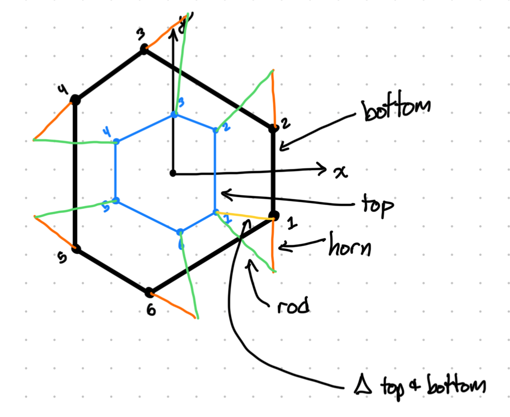
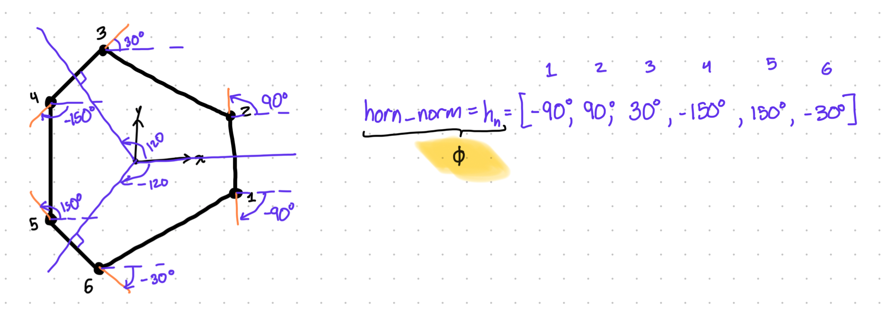
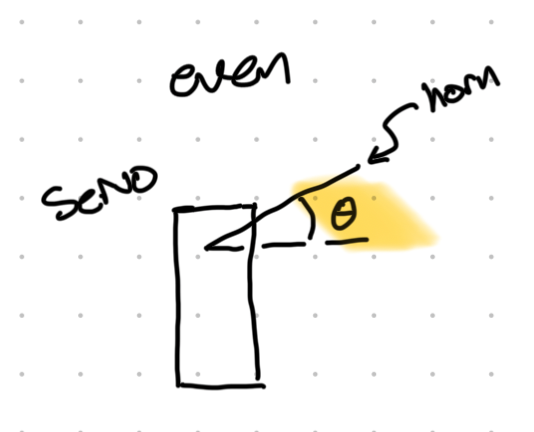
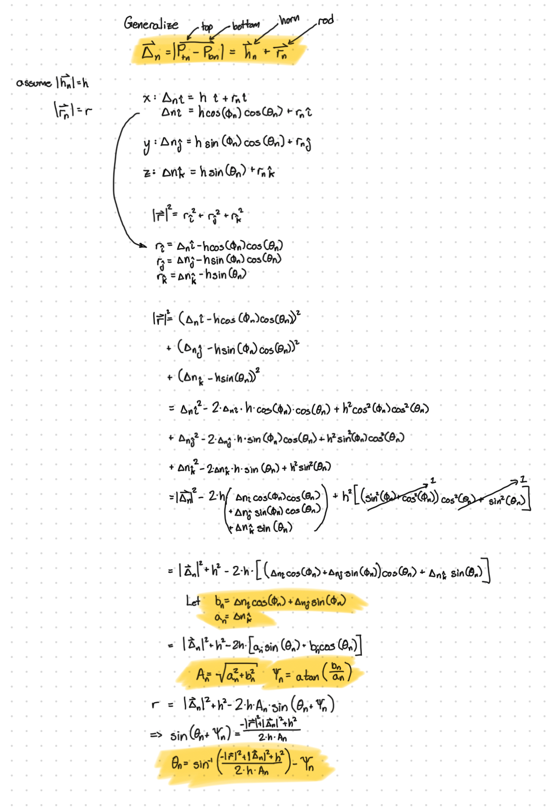
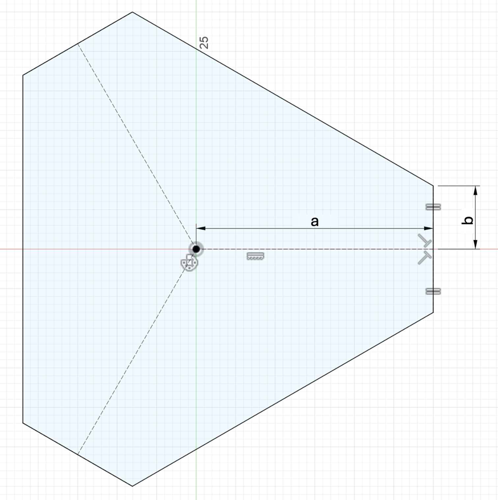

 

# Ball and Plate PID Controller

    <video width="500" height="300" controls>
    <source src="imgs/BallAndPlatePID/esp32_controller.mov" type="video/mp4">
    </video>
    
Final Ball and Plate PID Controller

## Table of Contents
* [Sensor and Filters](#sensor-and-filters)
* [Stewart Platform](#stewart-platform)
* [Controller](#controller)
* [Integration](#integration)

## Sensor and Filters

### Sensor / Resistive Touch Plate
For this project, I used a four-wire resistive touch plate. I won't go into how they work here, since there are many great online sources on how they work, but I will warn you: If you buy a cheap one off of eBay... you'll probably run into sensor quality issues and have to filter the **** out of the signal to get something reasonable, and that'll cause enough delay that its practically uncontrollable. 

Anyways, the raw signal I got out of the sensor had a lot of dropouts and was pretty much garbage. The dropouts happened for three reasons:
1. If the ball rolled over one of the bumps that divide up the grid for a resistive touch plate, there would be no change in resistance for the touch plate. This isn't an issue for when a person would push down with their finger because the bumps are so small, your finger would just push around the bump. Since the ball is effectively pushing down on a single point, it'll roll over the bump and there won’t be a sensor value for that point. 
1. The ball didn't apply enough pressure onto the plate. When I rotate the platform, the response is kind of jumpy because I don't command a rate for the servo motors. The ball doesn't always make the best contact with the plate and if there isn't enough pressure, you get either a full dropout or something like a partial dropout where it is some value between your current reading and whatever the dropout value is. 
1. Magic - Even when the plate was on a flat surface (not on the platform) and the ball was just sitting on the platform, it would partially drop out. I have no idea why, maybe it’s the microcontroller, but it would just magically drop out.

I used a 1-inch ball bearing bearing ball as the ball I was trying to balance.

### Filtering
Initially, when I wired up the resistive touch plate, I didn't have any pull down/up resistors, so when there was a dropout, the default value would say that the ball was at the center of the plate. I spent way too much time creating a filter to detect big jumps to the center of the plate, but what ended up happening was the system had a poor understanding of where the ball was at the commanded value of the center. I couldn't really get past this problem, and the system I had sat on a shelf for a couple months till I read an article on pull up/down resistors, and that made me think about my situation... and sure enough, when I incorporated a pull down resistor, a dropout would go down to a value of zero, and that dramatically helped filter out dropouts. However, there still was the issue of the 2nd bullet point, where the ball didn't apply enough pressure. This, however, was easy enough to filter out with a median filter.

After those two filters, I still had a pretty noisy signal (see image below). 

And that caused the platform to jitter a bunch, and if the noise was bad enough, it would cause the ball to jitter off of the plate. I tried the easiest filter I could thing

[Put in esp32 low pass filter]

[Put in alpha-beta filter]

## Stewart Platform

    <video width="500" height="500" controls>
    <source src="imgs/StewartPlatform/stewart_platform_python_gui.mov" type="video/mp4">
    </video>
    
Stewart Platform GUI

The video above shows the GUI I made to experiment with my Stewart platform design and check to make sure all my math was correct in determining the servo motor angles. 
- The red points  are the base and top points that are referenced in my code. 
    - The points on the base are the center of rotation for the servo motors. 
    - The points on the top/platform are where the rods holding up the platform are mounted. 
- The black lines are just connecting them to create a base and platform visual. 
- The yellow lines are the servo horns.
- The green/red/blue lines are the rods connecting the horn to the platform. 
    - If the line is green, that means the Stewart platform is in a valid geometry. 
    - Red rods mean that the rod is too small to achieve the desired geometry. 
    - Blue rods mean that the rod is too small to achieve the desired geometry. 
- The black axis at the top of the platform is the local platform axis (used to better show orientation)
- The grey axis is the platform at origin
- The purple line is the axis of rotation.

### Deriving the Equation of Motion

<!--  -->

    

To determine the angles that the servos moved to give the commanded platform angle, I first chose a commanded platform angle and calculated the location of the mounting points of the top plate. Knowing where I want the mounting points, I backed out the angles that the servos needed to be at (inverse kinematics). The math to resolve what angle each servo is commanded is a bit complicated, but I have it written out here. Phi, as defined by the first figure below, and it is the angle between the plane that the arm of the servo motor rotates on and the x-axis.

<!--  -->

    

Theta is the angle that each servo motor has with respect to its own local horizontal. 

<!--  -->

    

Knowing I had to program this at one point, I kept everything as generalized as possible. _n_ is the servo number, and I defined all the other variables with callouts in the equation.

<!--  -->

    

Towards the end there is a magical trig equation I introduce with <math><mrow><msub><mi>A</mi><mn>n</mn></msub></mrow></math> and <math><mrow><msub><mi>&Psi;</mi><mn>n</mn></msub></mrow></math>, and that is cleaning up what is in the square brackets to make it easier to solve. It is just the linear combination of sine and cosine.

### Optimizing the Platform
[Insert photo of final Stewart platform here/CAD model]

Since there are 6 motors to control the 6 degrees of freedom, I needed 6 mounting points. Following traditional Stewart platform designs, I chose to do that semi-hexagonal shape.

When I started this project, I prematurely bough a set of servo arms and rods to control the platforms 6DoF. I arbitrarily picked placements for the mounting points of the rods to the top plate and placement. As consequence of this, when I went to simulate its range of motion, it was not able to rotate a large amount (around 10 degrees off of horizontal). This wasn't very desirable, so I went through a study to find the _optimal_ location of mounting points without changing the lengths of the arms and horns. I wanted two things out of this optimization study:
1. When the platform is at level (zero degrees deflection about either the x-axis or y-axis), I want to minimize <math><mfrac><mrow><msub><mi>&delta;</mi><mn>platform angle</mn></msub></mrow><mrow><msub><mi>&delta;</mi><mn>servo angle</mn></msub></mrow></mfrac></math>. I did this for a couple reasons:
    - The mapping of motor command to angle was coarse and not perfect. If I commanded an angle, I had reasonable confidence in achieving <math><mi>&pm;</mi></math> 3 degrees the commanded value (I vaguely remember that number from the motor's specs).
    - With any geared motor, the servos had backlash, and I had low confidence I could keep a precise commanded angle. 
    - As I made my first prototype of this, I realized there was a lot of slop when all the hardware was mounted, and the platform had a lot of play.
1. A minimum of 20 degrees plat deflection about each axis. 
    - This was more of a vibe requirement; I looked at how much 20 degrees looked like with my phone level and felt like that was enough.

To find the optimal placement, I varied the locations of the mounting points.

Image of platform sizing

I swept through _a_, _b_ and commanded platform angle and, at each point, computed the following:
- How much the platform changed with respect to a servo (<math><mfrac><mrow><msub><mi>&delta;</mi><mn>platform angle</mn></msub></mrow><mrow><msub><mi>&delta;</mi><mn>servo angle</mn></msub></mrow></mfrac></math>)
- A check to see if the geometry of the servo motors/servo horns/arm is valid to achieve the commanded.

I looked for a couple things:
- When the commanded angle was zero, I wanted a low <math><mfrac><mrow><msub><mi>&delta;</mi><mn>platform angle</mn></msub></mrow><mrow><msub><mi>&delta;</mi><mn>servo angle</mn></msub></mrow></mfrac></math>. My thought here was, I wanted a higher resolution towards the middle. If a 5 degree deflection in a servo motor gave a 1 degree rotation in platform angle, it would be more robust to the poor servo motor quality. Coincidentally, this meant the platform had higher resolution when the ball was closer to the center of the platform and lower resolution when the ball was approaching the end of the platform.
- Made sure that a solution could achieve 20 degrees deflection in each axis

_I would show you a plot of what this looked like, but I did this as a quick one-off and apparently didn't save it. Since I'm documenting this towards the end of this project, I don't really see much value for me to re-make this script._

With that, all I had to do was pick a point that looked the best to me and plug that into my code/model.

Through the course of this, I noticed the cheap plastic servo horns that came with the servo motors were deflecting from the weight of the plate, so I upgraded those to aluminum horns.

## Controller

## Integration
### Convert Code:
I had written all my platform code in python to prototype, but to get it onto the Arduino, I had to trim it up and convert it into C++. I ended up 

I initially used an Arduino to complete this project, but with the Arduino, the system had a delay of ~0.4 seconds. So as soon as I applied pressure on the plate, the motors would take 0.4 seconds to move. I managed to create a controllable platform, but I truly have no idea why the entire system was so slow. After applying the filters, the response time was ~0.5 seconds. The result of this can be seen in the video below.

    <video width="500" height="300" controls>
    <source src="imgs/BallAndPlatePID/arduino_controller.mov" type="video/mp4">
    </video>
    
Arduino Controller

I wanted to have a faster response time, and I knew the ESP32 had ~10x clock speed over the Arduino. I had a spare ESP32-Cam laying around and when I uploaded the code to the ESP32, instead of a ~0.4 second response time, it was around ~0.05 second. Which was super encouraging. I still had to do a lot of filters, and when I applied too many filters, the response time increased to about ~0.4 seconds. So, I kept a bit of jitter to still have a good response time. 

    <video width="500" height="300" controls>
    <source src="imgs/BallAndPlatePID/esp32_controller.mov" type="video/mp4">
    </video>
    
ESP32 Controller

Overall, I'm pretty happy with it. Learned a lot and happy to share it with y’all.

[Go Home](README.md)